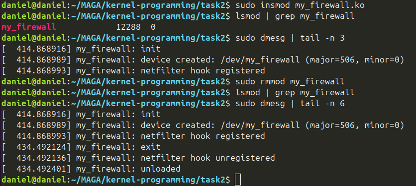
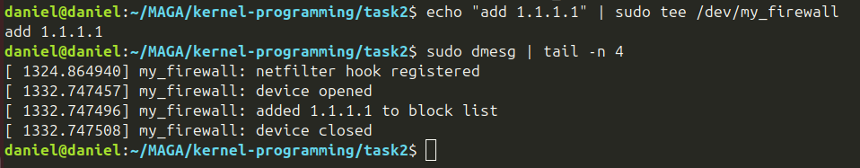
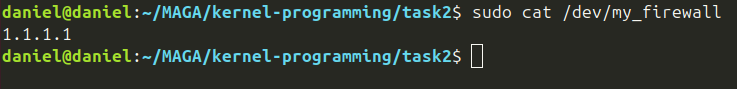
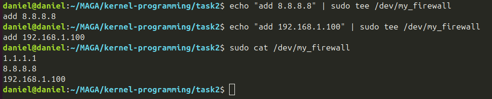
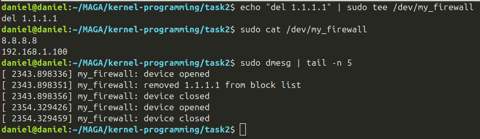
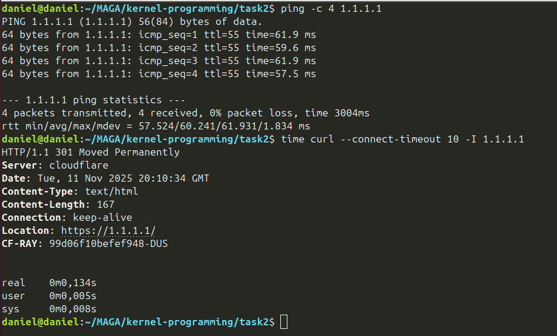
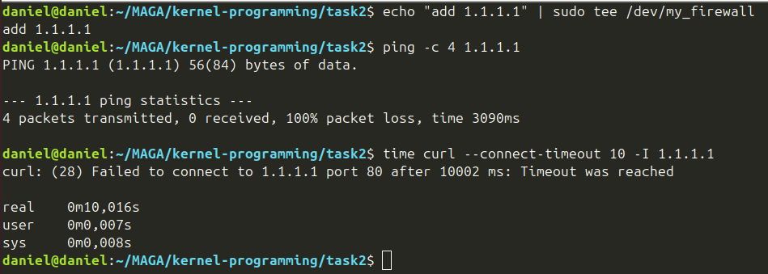

## 1. Введение

### 1.1 Постановка задачи

В рамках итогового проекта была поставлена задача разработать драйвер ядра Linux, способный блокировать входящий сетевой трафик с заданных IP-адресов. Драйвер должен:

- Интегрироваться с подсистемой Netfilter для перехвата сетевых пакетов
- Предоставлять интерфейс управления через символьное устройство `/dev/my_firewall`
- Поддерживать динамическое добавление и удаление IP-адресов в черный список
- Корректно работать в многозадачной среде с использованием механизмов синхронизации

### 1.2 Актуальность и цели работы

**Актуальность:**

Сетевая безопасность является критически важным аспектом современных информационных систем. Возможность блокировать трафик с определенных IP-адресов на уровне ядра позволяет эффективно защищать систему от нежелательных соединений, DDoS-атак и других угроз. Реализация такого механизма в виде модуля ядра обеспечивает минимальные накладные расходы и максимальную производительность.

**Цели работы:**

1. Изучить механизмы работы подсистемы Netfilter в ядре Linux
2. Реализовать драйвер для фильтрации сетевого трафика
3. Создать пользовательский интерфейс для управления правилами фильтрации
4. Обеспечить потокобезопасность при доступе к разделяемым ресурсам
5. Продемонстрировать навыки программирования в режиме ядра

---

## 3. Программная архитектура

### 3.1 Общее описание архитектуры

Драйвер `my_firewall` состоит из двух основных компонентов:

1. **Ядро логики (Netfilter Hook)** - перехватывает входящие сетевые пакеты на этапе `NF_INET_PRE_ROUTING` и принимает решение о блокировке на основе IP-адреса источника.

2. **Интерфейс управления (Character Device)** - символьное устройство `/dev/my_firewall`, через которое пользователь может добавлять и удалять IP-адреса из черного списка, а также просматривать текущий список заблокированных адресов.

**Схема работы:**

```
[Сетевой пакет] → [Netfilter Hook] → [Проверка IP в черном списке]
                                              ↓
                                    ┌─────────┴─────────┐
                                    ↓                   ↓
                              [NF_DROP]           [NF_ACCEPT]
                           (блокировка)          (пропуск)

[Пользователь] → [/dev/my_firewall] → [write/read] → [Черный список IP]
```

### 3.2 Используемые структуры данных

**Структура для хранения заблокированного IP:**

```c
struct blocked_ip {
    struct list_head list;  // Узел для связывания в список
    __be32 ip;             // IP-адрес
};
```

**Черный список IP-адресов:**

```c
static LIST_HEAD(blocked_ip_list);
```

Используется стандартный двусвязный список ядра Linux (`struct list_head`), который предоставляет эффективные операции вставки, удаления и обхода элементов. Список содержит структуры `blocked_ip`, каждая из которых хранит один заблокированный IP-адрес.

### 3.3 Механизм синхронизации

Для защиты черного списка от гонок при одновременном доступе используется **rwlock (read-write lock)**:

```c
static DEFINE_RWLOCK(ip_list_lock);
```

**Обоснование выбора rwlock:**

1. **Параллельное чтение:** Rwlock позволяет нескольким потокам одновременно читать данные, что критично для производительности, так как хук Netfilter вызывается для каждого входящего пакета.

2. **Эксклюзивная запись:** При выполнении операций записи (add/del IP) блокируется как чтение, так и запись, что гарантирует консистентность данных.

**Почему не mutex:**
- Mutex нельзя использовать в контексте прерывания (softirq), а хук Netfilter выполняется именно в таком контексте
- Mutex не поддерживает разделение на чтение/запись

**Почему не spinlock:**
- Обычный spinlock блокирует доступ всем потокам, даже читающим
- Это снизило бы производительность при частых проверках IP

### 3.4 Интерфейс взаимодействия с User Space

Драйвер предоставляет следующие команды для управления через запись в `/dev/my_firewall`:

**Формат команд:**

```
add <IP-адрес>    - добавить IP в черный список
del <IP-адрес>    - удалить IP из черного списка
```

**Примеры использования:**

```bash
# Добавить IP-адрес
echo "add 1.1.1.1" | sudo tee /dev/my_firewall

# Удалить IP-адрес
echo "del 1.1.1.1" | sudo tee /dev/my_firewall

# Просмотр текущего списка
cat /dev/my_firewall
```

**Особенности реализации:**

- IP-адреса передаются в стандартном текстовом формате (X.X.X.X)
- Конвертация из строки в `__be32` выполняется функцией `in_aton()`
- Конвертация из `__be32` в строку выполняется через `snprintf()` с форматом `%pI4`
- Максимальная длина команды: 128 байт

---

## 4. Описание реализации

### 4.1 Инициализация модуля

Функция `myfw_init()` выполняет следующие шаги при загрузке модуля:

**Шаг 1: Регистрация символьного устройства**

```c
// Выделение динамического номера устройства
ret = alloc_chrdev_region(&dev_number, 0, 1, DEVICE_NAME);

// Инициализация cdev структуры
cdev_init(&my_cdev, &myfw_fops);
ret = cdev_add(&my_cdev, dev_number, 1);

// Создание класса устройства
my_class = class_create(CLASS_NAME);

// Создание файла устройства в /dev
my_device = device_create(my_class, NULL, dev_number, NULL, DEVICE_NAME);
```

**Комментарий:** Использование `alloc_chrdev_region` позволяет ядру автоматически выбрать свободный major number, что избегает конфликтов с другими устройствами. Создание класса и устройства через `class_create` и `device_create` автоматически создает файл `/dev/my_firewall` с корректными правами доступа.

**Шаг 2: Регистрация Netfilter hook**

```c
// Настройка параметров хука
my_nfho.hook = my_firewall_hook_func;      // Функция-обработчик
my_nfho.pf = PF_INET;                      // Протокол IPv4
my_nfho.hooknum = NF_INET_PRE_ROUTING;     // Точка перехвата
my_nfho.priority = NF_IP_PRI_FIRST;        // Приоритет выполнения

// Регистрация хука
ret = nf_register_net_hook(&init_net, &my_nfho);
```

**Комментарий:** 
- `NF_INET_PRE_ROUTING` - точка перехвата, где пакеты обрабатываются сразу после получения из сети, до маршрутизации
- `NF_IP_PRI_FIRST` - максимальный приоритет, наш фильтр будет первым в цепочке обработчиков
- `&init_net` - указывает на глобальное сетевое пространство имен

### 4.2 Функция фильтрации пакетов

```c
static unsigned int my_firewall_hook_func(void *priv,
                                         struct sk_buff *skb,
                                         const struct nf_hook_state *state)
{
    struct iphdr *ip_header;
    __be32 src;

    // Проверка валидности SKB
    if (!skb)
        return NF_ACCEPT;

    // Проверка протокола (только IPv4)
    if (skb->protocol != htons(ETH_P_IP))
        return NF_ACCEPT;

    // Извлечение IP-заголовка
    ip_header = ip_hdr(skb);
    if (!ip_header)
        return NF_ACCEPT;

    // Получение IP-адреса источника
    src = ip_header->saddr;

    // Проверка наличия IP в черном списке
    read_lock(&ip_list_lock);
    if (find_blocked_ip(src)) {
        read_unlock(&ip_list_lock);
        return NF_DROP;  // БЛОКИРОВКА
    }
    read_unlock(&ip_list_lock);

    return NF_ACCEPT;  // ПРОПУСК
}
```

**Логика работы:**

1. **Валидация:** Проверяем, что SKB (socket buffer) не пустой и содержит IPv4-пакет
2. **Извлечение IP:** Получаем адрес источника из IP-заголовка
3. **Критическая секция:** Под read-lock проверяем наличие IP в черном списке
4. **Вердикт:** Возвращаем `NF_DROP` (блокировка) или `NF_ACCEPT` (пропуск)

**Важно:** Функция выполняется в контексте softirq, поэтому недопустимо использование функций, которые могут спать (sleep). Используется только `read_lock()`, которая безопасна в этом контексте.

### 4.3 Операции с черным списком

**Функция поиска IP:**

```c
static struct blocked_ip *find_blocked_ip(__be32 ip)
{
    struct blocked_ip *entry;
    list_for_each_entry(entry, &blocked_ip_list, list) {
        if (entry->ip == ip)
            return entry;
    }
    return NULL;
}
```

**Функция добавления IP:**

```c
static int add_ip_to_block(__be32 ip)
{
    struct blocked_ip *e;

    // Проверка на дубликаты
    if (find_blocked_ip(ip))
        return -EEXIST;

    // Выделение памяти
    e = kmalloc(sizeof(*e), GFP_KERNEL);
    if (!e)
        return -ENOMEM;

    // Инициализация и добавление в список
    INIT_LIST_HEAD(&e->list);
    e->ip = ip;
    list_add_tail(&e->list, &blocked_ip_list);
    return 0;
}
```

**Функция удаления IP:**

```c
static int del_ip_from_block(__be32 ip)
{
    struct blocked_ip *e;

    // Поиск элемента
    e = find_blocked_ip(ip);
    if (!e)
        return -ENOENT;

    // Удаление из списка и освобождение памяти
    list_del(&e->list);
    kfree(e);
    return 0;
}
```

### 4.4 Реализация операций устройства

**Операция чтения (read):**

```c
static ssize_t myfw_read(struct file *filp, char __user *buf, 
                         size_t count, loff_t *ppos)
{
    char *kbuf;
    size_t written = 0;
    struct blocked_ip *entry;

    // Проверка EOF (предотвращение повторного чтения)
    if (*ppos > 0)
        return 0;

    // Выделение буфера ядра
    kbuf = kmalloc(READ_BUF_SIZE, GFP_KERNEL);
    if (!kbuf)
        return -ENOMEM;

    kbuf[0] = '\0';

    // Формирование списка IP под read-lock
    read_lock(&ip_list_lock);
    list_for_each_entry(entry, &blocked_ip_list, list) {
        int l = snprintf(kbuf + written, READ_BUF_SIZE - written, 
                        "%pI4\n", &entry->ip);
        if (l < 0) {
            ret = -EOVERFLOW;
            goto out_unlock;
        }
        written += l;
        if (written >= READ_BUF_SIZE - 1)
            break;
    }
out_unlock:
    read_unlock(&ip_list_lock);

    // Копирование данных в пространство пользователя
    if (copy_to_user(buf, kbuf, min(count, written))) {
        kfree(kbuf);
        return -EFAULT;
    }
    
    *ppos += min(count, written);
    kfree(kbuf);
    return min(count, written);
}
```

**Особенности реализации:**
- Формат `%pI4` автоматически конвертирует `__be32` в строку вида "X.X.X.X"
- Использование `copy_to_user()` для безопасной передачи данных из ядра в user space
- Проверка `*ppos > 0` для корректной работы с утилитой `cat`

**Операция записи (write):**

```c
static ssize_t myfw_write(struct file *filp, const char __user *buf, 
                          size_t count, loff_t *ppos)
{
    char kbuf[WRITE_BUF_SIZE];
    char cmd[8];
    char ipstr[32];
    __be32 ip;
    int scanned;

    if (count >= WRITE_BUF_SIZE)
        return -EINVAL;

    // Копирование команды из user space
    if (copy_from_user(kbuf, buf, count))
        return -EFAULT;

    kbuf[count] = '\0';

    // Удаление trailing newline
    if (kbuf[count-1] == '\n')
        kbuf[count-1] = '\0';

    // Парсинг команды
    scanned = sscanf(kbuf, "%7s %31s", cmd, ipstr);
    if (scanned != 2) {
        pr_info("my_firewall: invalid command. Use: add/del <ip>\n");
        return -EINVAL;
    }

    // Конвертация IP из строки
    ip = in_aton(ipstr);

    // Выполнение команды
    if (strcmp(cmd, "add") == 0) {
        int err;
        write_lock(&ip_list_lock);
        err = add_ip_to_block(ip);
        write_unlock(&ip_list_lock);
        
        if (err == -EEXIST) {
            pr_info("my_firewall: %pI4 already in block list\n", &ip);
        } else if (err) {
            pr_err("my_firewall: failed to add %pI4 (err=%d)\n", &ip, err);
            return err;
        } else {
            pr_info("my_firewall: added %pI4 to block list\n", &ip);
        }
        return count;
    } else if (strcmp(cmd, "del") == 0) {
        int err;
        write_lock(&ip_list_lock);
        err = del_ip_from_block(ip);
        write_unlock(&ip_list_lock);
        
        if (err == -ENOENT) {
            pr_info("my_firewall: %pI4 not found in block list\n", &ip);
        } else if (err) {
            pr_err("my_firewall: failed to delete %pI4 (err=%d)\n", &ip, err);
            return err;
        } else {
            pr_info("my_firewall: removed %pI4 from block list\n", &ip);
        }
        return count;
    }
    
    pr_info("my_firewall: unknown command '%s'\n", cmd);
    return -EINVAL;
}
```

**Ключевые моменты:**
- Использование `copy_from_user()` для безопасного получения данных
- Парсинг команды с помощью `sscanf()`
- Конвертация IP-адреса функцией `in_aton()` (ASCII to Network)
- Логирование всех операций через `pr_info()` и `pr_err()`
- Возврат количества обработанных байт (`count`) для корректной работы `echo`

### 4.5 Выгрузка модуля

```c
static void __exit myfw_exit(void)
{
    struct blocked_ip *entry, *tmp;

    // 1. Отключение Netfilter hook
    nf_unregister_net_hook(&init_net, &my_nfho);

    // 2. Очистка черного списка
    write_lock(&ip_list_lock);
    list_for_each_entry_safe(entry, tmp, &blocked_ip_list, list) {
        list_del(&entry->list);
        kfree(entry);
    }
    write_unlock(&ip_list_lock);

    // 3. Удаление устройства
    device_destroy(my_class, dev_number);
    class_destroy(my_class);
    cdev_del(&my_cdev);
    unregister_chrdev_region(dev_number, 1);

    pr_info("my_firewall: unloaded\n");
}
```

**Порядок выгрузки критичен:**
1. Сначала отключаем хук - новые пакеты не будут обрабатываться
2. Затем очищаем список под блокировкой - гарантируем отсутствие гонок
3. В конце удаляем устройство - освобождаем ресурсы

---

## 5. Протокол тестирования

### 5.1 Загрузка и выгрузка модуля

**Команды для тестирования:**

```bash
# Компиляция модуля
make

# Загрузка модуля
sudo insmod my_firewall.ko

# Проверка загрузки
lsmod | grep my_firewall

# Просмотр логов ядра
dmesg | tail -n 20

# Выгрузка модуля
sudo rmmod my_firewall

# Проверка логов выгрузки
dmesg | tail -n 10
```

**Загрузка и выгрузка модуля**



### 5.2 Тестирование интерфейса управления

**Добавление IP в черный список:**

```bash
# Добавление IP-адреса
echo "add 1.1.1.1" | sudo tee /dev/my_firewall

# Проверка логов
dmesg | tail -n 5
```

**Добавление IP**



**Просмотр черного списка:**

```bash
cat /dev/my_firewall
```

**Вывод cat /dev/my_firewall**



**Добавление нескольких IP:**

```bash
echo "add 8.8.8.8" | sudo tee /dev/my_firewall
echo "add 192.168.1.100" | sudo tee /dev/my_firewall
cat /dev/my_firewall
```

**Вывод cat /dev/my_firewall**



**Удаление IP из черного списка:**

```bash
echo "del 1.1.1.1" | sudo tee /dev/my_firewall
cat /dev/my_firewall
dmesg | tail -n 5
```

**Вывод после удаления IP**



### 5.3 Тестирование фильтрации трафика

**Тест 1: Ping и curl до блокировки**

```bash
ping -c 4 1.1.1.1

time curl --connect-timeout 10 -I 1.1.1.1
```

**ping и curl до блокировки**



**Тест 2: Ping и curl после блокировки**

```bash
echo "add 1.1.1.1" | sudo tee /dev/my_firewall

ping -c 4 1.1.1.1
time curl --connect-timeout 10 -I 1.1.1.1
```

**ping и curl после блокировки**



## 6. Заключение

В ходе работы был разработан и протестирован мини-файрвол на базе `Netfilter`, реализованный в виде загружаемого модуля ядра Linux.

Основные результаты:

* реализован `Netfilter-хук` для фильтрации IPv4-пакетов;

* обеспечено взаимодействие с user space через символьное устройство `/dev/my_firewall`;

* реализована потокобезопасная работа со списком IP при помощи `rwlock`;

* проведено тестирование с использованием `ping`, `curl` и `dmesg`.

## 7. Приложение
[Репозиторий](https://github.com/danielsheh02/kernel-programming)

[Запись демо](https://drive.google.com/file/d/1rXGIKycrvu9O1co7WMp2Dcp9lV-dK5o3/view?usp=sharing)